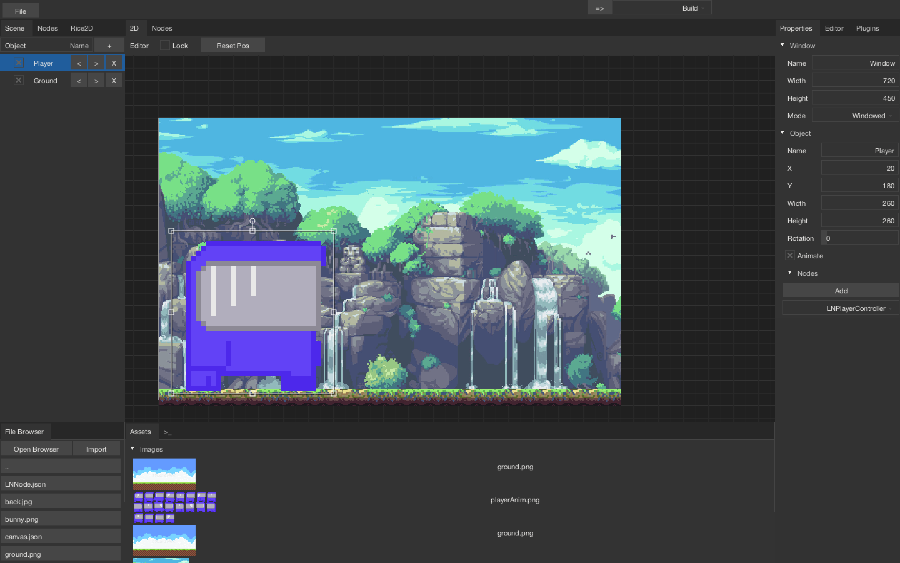
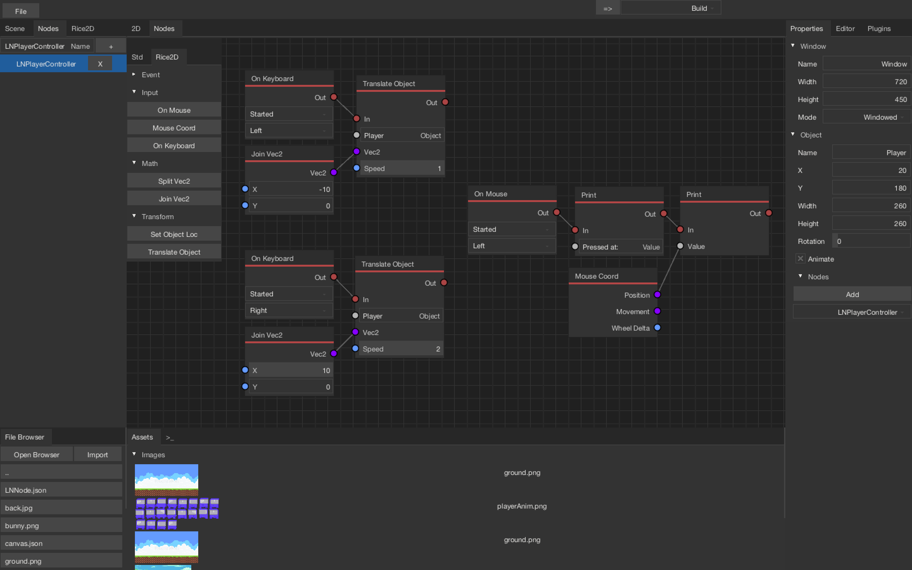

# Paddy-Editor
[Paddy-Editor](https://blackgoku36.github.io/Paddy-Editor-Website/) is framework/engine agnostic 2D game editor written in Haxe with Kha

Main Editor with Rice2D plugin activated

Nodes Editor with Rice2D plugin activated

